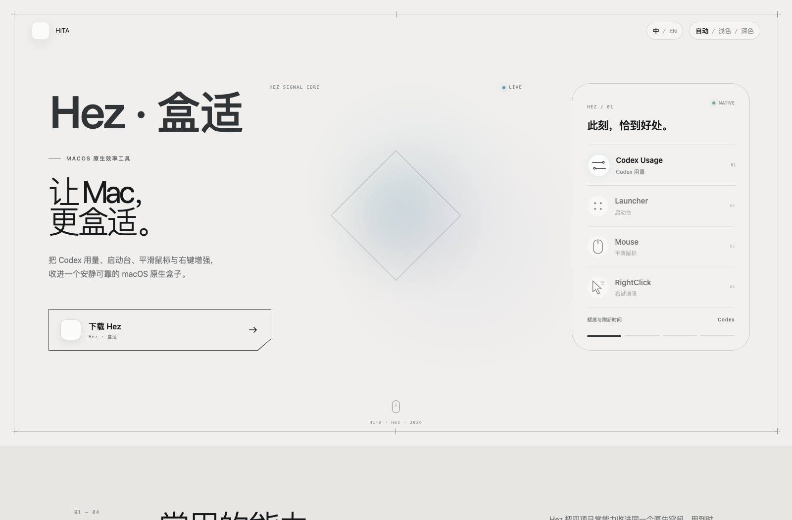
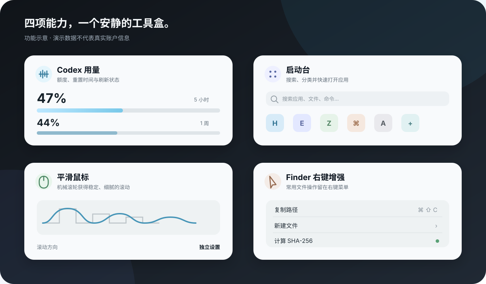

  
  <h1>Hez · 盒适</h1>
  
把常用的 macOS 小能力，收进一个安静、原生、清晰的工具盒。

  

    <a href="https://hitaing.top/">官网</a> ·
    <a href="https://hitaing.top/download">下载</a> ·
    <a href="https://hitaing.top/changelog">更新日志</a> ·
    <a href="https://hitaing.top/privacy">隐私政策</a>
  

<!-- hez-current-release:start -->
**当前公开测试版：Hez 1.0（Build 21）** · [下载](https://hitaing.top/download) · [查看 SHA-256](https://hitaing.top/updates/public-preview.json)
<!-- hez-current-release:end -->

## Hez 是什么

Hez 是一款原生 macOS 效率工具，将四项日常能力统一到一个 App 中，减少零散应用对 Dock 与菜单栏空间的占用，也让常用设置、权限和诊断拥有一致的入口。

| 功能 | 作用 |
| --- | --- |
| Codex 用量 | 在本机读取并展示 Codex 使用额度与刷新状态 |
| 启动台 | 用熟悉的网格与搜索方式快速打开应用 |
| 平滑鼠标 | 改善外接机械鼠标的滚动手感，并提供独立方向设置 |
| 右键增强 | 为 Finder 补充复制信息、新建文件、压缩与校验等常用操作 |

功能示意图使用演示数据，不包含真实账户或本机信息。实际界面会随公开测试版继续调整。

## 产品原则

- **原生体验**：优先采用 SwiftUI、AppKit 与 macOS 系统能力。
- **本地优先**：可在本机完成的处理不上传；权限按功能实际需要使用。
- **清晰可控**：四项功能可分别启停，权限状态与诊断集中展示。
- **安静运行**：主窗口关闭后仍可由菜单栏唤回，不制造无意义通知。

## 系统要求

- macOS 14 或更高版本
- Apple 芯片 Mac（arm64）

当前提供的是未公证公开测试版。首次安装及启用 Finder、输入监听等系统能力时，请以[下载页](https://hitaing.top/download)的说明为准。

## 反馈与建议

欢迎通过 [Issues](https://github.com/hita126/Hez/issues) 提交问题或功能建议。报告问题时，建议附上：

- macOS 与 Mac 型号
- Hez 版本和 Build
- 可复现步骤与实际结果
- “通用 → 诊断信息”中适合公开的内容

请勿在公开 Issue 中提交账户信息、访问令牌、个人文件内容或其他敏感数据。安全问题请查看 [SECURITY.md](SECURITY.md)。

## 关于源码

此仓库用于 Hez 的产品说明、版本信息与公开反馈管理。Hez 应用源码目前未在此仓库公开，也没有授予开源许可。

---

Hez is a native macOS utility that brings Codex Usage, Launcher, Mouse and RightClick into one calm, consistent app. Product source code is not currently published in this repository.
